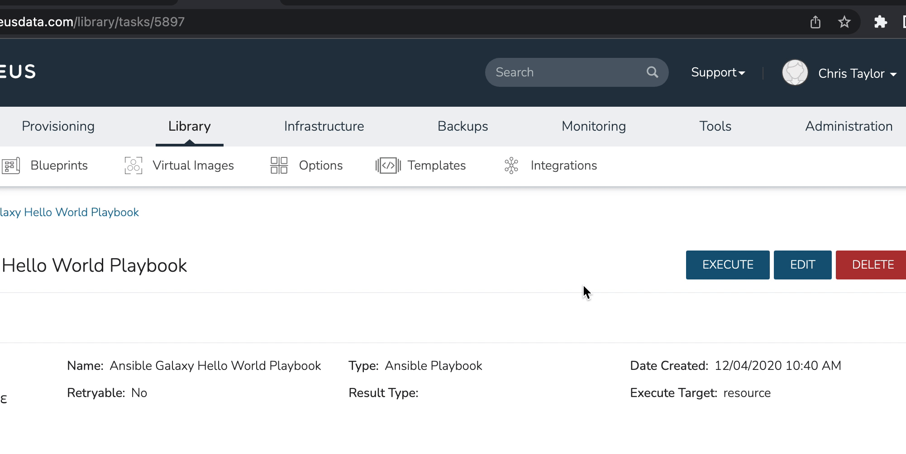

# morpheus-tenant-safe-link-generator-plugin

Example Global UI Morpheus Plugin that enables an option in the UI header for generating tenant safe links that can be bookmarked/saved.

Accessing a link generated by this plugin will guarantee that a user will be presented with their tenant specific login page and redirected to the saved endpoint when using the link (and unauthenticated).

